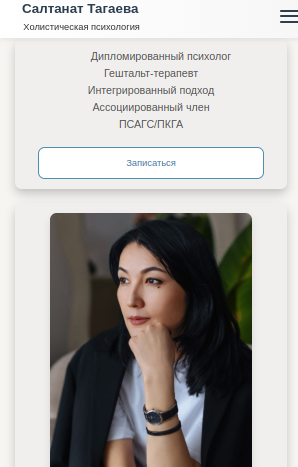
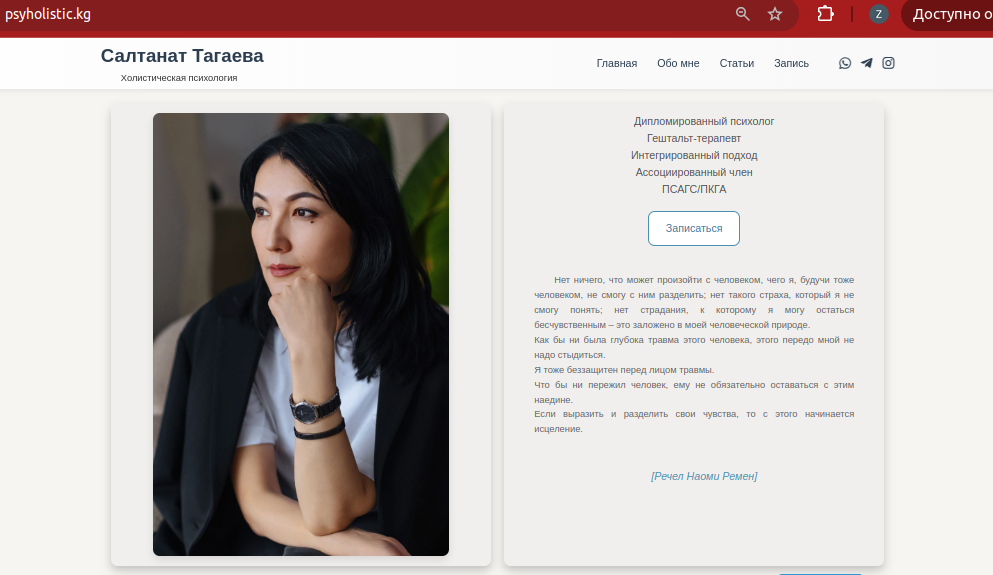
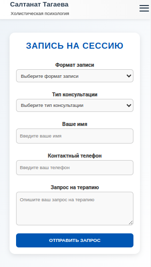

# 🧠 Psyholistic.kg — Психолог Салтанат Тагаева

---

## 🇷🇺 О проекте

Сайт [psyholistic.kg](https://psyholistic.kg) — это современный, адаптивный и интуитивно понятный веб-сервис для записи на консультации к психологу Салтанат Тагаевой.

Полностью разработан мной — от идеи и дизайна до реализации логики и анимаций.

---

## 🧩 Функционал

- 📅 **Онлайн-бронирование** без регистрации — форма записи с отправкой в Telegram-бот.
- 🧾 **Документы и сертификаты** — в открытом доступе.
- 🖼 **Галерея работ** — фото до/после, слайдер.
- 📰 **Переход к статьям** — на нужный абзац по якорю со страницы.
- 🎯 **Плавный UX** — плавный скролл, анимации, слайдеры.
- 📱 **Мобильная версия** — адаптив под любые устройства.
- ✅ **Все ссылки рабочие**.

---

## 🛠️ Технологии

- **Frontend:** [Vite](https://vitejs.dev/), React.js, JavaScript, CSS Modules, Framer Motion
- **Интеграции:** Telegram Bot API
- **Дизайн:** кастомный (разработка в Figma и вручную в коде)
- **Деплой:** [Vercel](https://vercel.com)

---

## 🔗 Сайт

👉 [https://psyholistic.kg](https://psyholistic.kg)

---

## 📸 Скриншоты

### 🏠 Главная страница (мобильная версия)

### 🧘‍♀️ Главная страница (десктоп)

### 📝 Форма записи на сессию

---

## 🧑‍💻 Автор

Разработка и дизайн: **Наргиз Мамытова**  
📂 [GitHub](https://github.com/NargizMam)  
📬 [Telegram](https://t.me/nargizmam)

---

## 💬 Связь

Есть предложения или нашли баг? Открывайте issue или пишите в Telegram.

---

## 📜 Лицензия

🛑 **Все права защищены**. Проект не является open-source.

---

## 🇬🇧 English Version

### 🧠 Psyholistic.kg — Psychologist Saltanat Tagaeva

[psyholistic.kg](https://psyholistic.kg) is a modern, responsive and elegant website for booking psychological sessions with certified therapist Saltanat Tagaeva.

This project was **fully designed and developed by me** — including layout, UX/UI, smooth animations, logic and integrations.

---

### 🔧 Features

- 📅 **Session booking without registration** — simple form sent to a Telegram bot.
- 🧾 **Certificates & legal documents** — available for viewing.
- 🖼 **Work gallery** — before/after photos in a slider.
- 📰 **Smart navigation** — jump to relevant article section via anchor links.
- 🎯 **Smooth UX** — scroll, transitions, and page routing.
- 📱 **Mobile-ready** — fully responsive on all screen sizes.
- ✅ **All links and forms are functional**.

---

### 💻 Technologies

- **Frontend:** Vite, React.js, JavaScript, CSS Modules, Framer Motion
- **Integrations:** Telegram Bot API
- **Design:** Custom (built manually in code + Figma)
- **Hosting:** Vercel

---

### 🔗 Live Website

👉 [https://psyholistic.kg](https://psyholistic.kg)

---

### 👩‍💻 Author

Created by **Nargiz Mamytova**  
GitHub: [@NargizMam](https://github.com/NargizMam)  
Telegram: [@fullstacknargiz](https://t.me/fullstacknargiz)

---

### 📜 License

**All rights reserved**. This project is not open-source.
